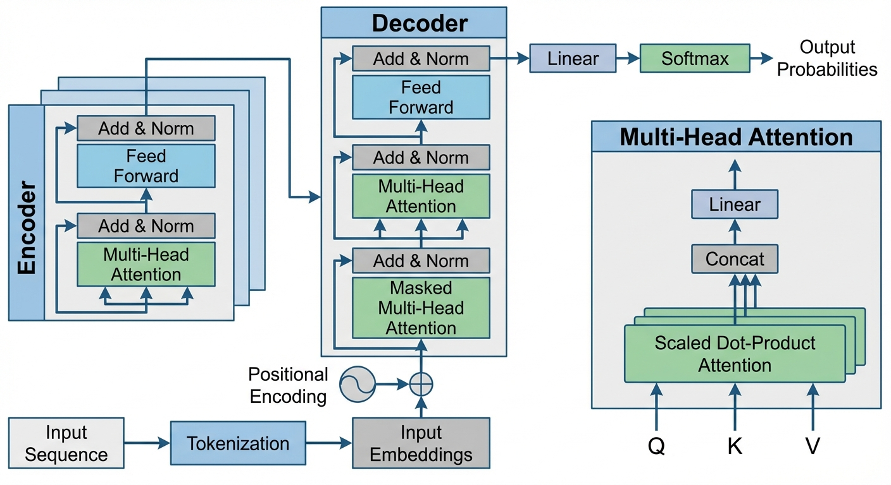
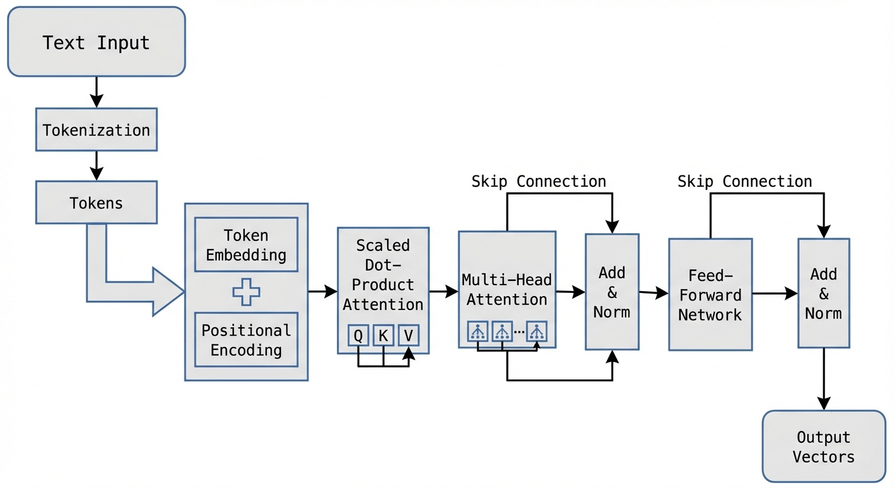
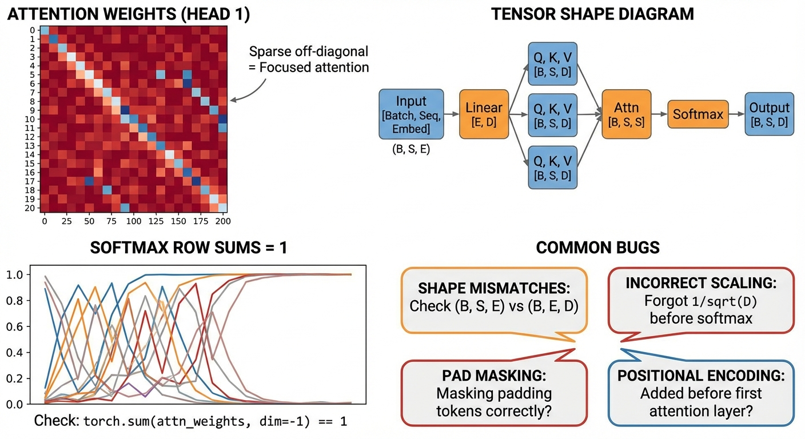

# Build a Transformer from Scratch (Without Framework Magic)

## Introduction to Transformers and Core Terminology

Transformers are a type of model designed to understand and generate sequences of data, like sentences in language. Before transformers were common, models like Recurrent Neural Networks (RNNs) and Convolutional Neural Networks (CNNs) were used to process sequences. However, these earlier models had trouble capturing long-distance relationships in text because they processed data step-by-step or focused on local patterns. Transformers solve this by using a mechanism called **attention**, which lets the model look at every part of the sequence all at once. This means it can find important connections between words, no matter how far apart they are.

To understand how transformers work, it’s important to know some key terms:

- **Tokens:** The basic units transformers work on. Usually, tokens are words or pieces of words extracted from text. For example, the sentence *“I love cats”* might be split into tokens: *“I”*, *“love”*, *“cats”*.

- **Embeddings:** Since models can’t directly understand words, tokens are converted into numeric vectors called embeddings. These vectors capture meanings and relationships between words in a way the model can use.

- **Self-Attention:** This is the core idea behind transformers. Self-attention lets each token focus on other tokens in the sequence, deciding which ones are important for understanding its meaning. For example, in the sentence *“The cat that chased the mouse is tired”*, the word *“cat”* needs to pay attention to *“chased”* and *“mouse”* to make sense.

- **Multi-Head Attention:** Instead of having one set of attention weights, transformers use multiple “heads” that each look at the sequence differently. This helps the model capture various types of relationships between tokens at the same time.

- **Positional Encoding:** Since transformers look at the whole sequence simultaneously, they need a way to know the order of tokens. Positional encoding injects information about the position of each token, so the model understands which word comes first, second, etc.

- **Feed-Forward Layers:** After attention processes the data, feed-forward layers further transform the information with simple neural networks applied to each token separately. This helps the model build complex features for decision-making.

The transformer architecture is mainly made of two parts:

- **Encoder:** Reads the input sequence and creates a representation of it.

- **Decoder:** Uses the encoder’s output and generates a new sequence, like translating or completing a sentence.

These parts are built from multiple layers, each containing attention heads and feed-forward networks stacked on top of each other to capture richer details.

Transformers have replaced older models like RNNs and CNNs in natural language processing (NLP) because:

- They process sequences in parallel, making them faster to train.
- Attention lets them model long-range dependencies well.
- They scale better with more data and compute.

Finally, when we say *“without framework magic”* in this tutorial, it means we won’t use any special pre-built transformer functions or layers from deep learning libraries. Instead, we'll build every component from the ground up with simple code you can understand fully. This hands-on approach will deepen your intuition about how transformers really work.

### Recap

- Transformers use attention, not just sequence-based steps, to understand input.
- Tokens, embeddings, self-attention, multi-head attention, and positional encoding are key concepts.
- The architecture includes encoders, decoders, layers, and attention heads.
- Transformers have advantages over RNNs and CNNs for NLP tasks.
- This tutorial builds transformers step-by-step, without relying on hidden framework features.


*Overview of Transformer Architecture with core components labeled*

## Building a Mental Model: Step-by-Step Data Flow in a Transformer

To understand how a transformer processes language, it helps to picture the flow of data from raw text all the way through to the output representation. Let's break this down step-by-step.

### From Text Tokens to Embeddings and Positional Encodings

Imagine you start with a sentence like "She loves cats." The first step is to split this sentence into **tokens**, which are essentially words or subwords—in this case: ["She", "loves", "cats"]. Each token is then converted into a **vector** called an **embedding**. Think of embeddings as numerical fingerprints capturing some meaning of each token.

However, since transformers have no sense of word order, we add a **positional encoding** to each embedding. This encoding is another vector that represents the token's position in the sentence. When added to embeddings, this tells the model which word comes first, second, and so forth.

### Calculating Scaled Dot-Product Attention by Hand

The core operation in a transformer is **scaled dot-product attention**. It helps the model look at other words to understand context.

Suppose you have query, key, and value vectors for three tokens:

- Query Q = [1, 0]
- Key K = [0, 1]
- Value V = [1, 2]

We compute the attention scores by taking the dot product (multiply corresponding elements and sum) of Q and each K vector, then scaling by dividing by the square root of the key vector's dimension (here, sqrt(2)) for stability.

For example:

```
Dot product Q·K = 1*0 + 0*1 = 0
Scaled score = 0 / sqrt(2) = 0
```

These scores go through a softmax (which turns them into weights summing to 1), then the model multiplies weights by the value vectors and sums them, producing a context vector that lets the query "pay attention" to the most relevant parts of the input.

### How Multi-Head Attention Combines Information

Instead of one attention operation, transformers run multiple in parallel—called **heads**. Each head uses different learned projections of Q, K, and V. Think of it like having multiple eyes looking at different aspects of the sentence, each forming its own context vector.

These context vectors are then concatenated (joined side-by-side) and linearly transformed to combine the diverse information before passing it forward.

### Feed-Forward Sub-layer Role with a Simple Numerical Example

After attention, each token's vector goes through a **feed-forward network**—a couple of simple math operations boosting the model’s ability to learn complex features.

For example, a vector [2, 3] might be multiplied by a weight matrix and then passed through a non-linear function like ReLU (which replaces negative values with zero):

```
Input: [2, 3]
Weight matrix: [[1, -1],
                [0, 2]]

Output = ReLU([2*1 + 3*0, 2*(-1) + 3*2]) = ReLU([2, 4]) = [2, 4]
```

This helps the model transform and refine token representations after attention.

### Skip Connections and Layer Normalization Concepts

To make training stable and enable better gradient flow, transformers use **skip connections** (also called residual connections). This means the input vector to a sub-layer is added directly to the sub-layer’s output before further processing.

Imagine if after feed-forward, the output is [2, 4] and the original input was [1, 1], the added result is [3, 5].

Following this, **layer normalization** adjusts these values to have a consistent scale and distribution, helping the model learn more effectively over time.

---

### Recap:

- Tokens turn into embeddings plus positional information.
- Scaled dot-product attention calculates relevance scores manually.
- Multi-head attention lets the model see different contexts simultaneously.
- Feed-forward networks transform token vectors to learn complex features.
- Skip connections and layer normalization improve training stability and performance.

With this pathway clear, you’re ready to start coding each component step-by-step!


*Step-by-step data flow in a Transformer: from text tokens to final output*

## Implementing Basic Components: Tokenization, Embeddings, and Positional Encoding

Before we dive into the Transformer’s core attention mechanism, we need to prepare the input data in a way the model can understand. This involves three key steps: tokenization, creating token embeddings, and adding positional encoding. Let’s explore each one in simple terms, then implement them with clear examples using just Python and Numpy.

### 1. Tokenization: Splitting Text into Tokens

Tokenization means breaking a sentence into smaller pieces called *tokens*. Tokens are often words or subwords. Since our goal is simplicity, we'll split text by spaces into words.

Think of tokens as puzzle pieces: the Transformer takes these pieces as input, rather than raw sentences.

**Simple tokenizer function:**

```python
def simple_tokenizer(text):
    # Convert text to lowercase and split by space
    tokens = text.lower().split()
    return tokens

# Example usage
text = "Hello Transformer world"
tokens = simple_tokenizer(text)
print(tokens)  # Output: ['hello', 'transformer', 'world']
```

### 2. Token Embeddings: Representing Tokens as Vectors

The Transformer doesn’t process words directly. Instead, each token is converted to a fixed-length vector of numbers. These vectors are called *embeddings*. 

Think of embeddings like coordinates on a map—each word is a point in a multi-dimensional space, capturing some idea about the word.

We will create a simple embedding matrix where each token ID maps to a learnable vector. Since we’re not using frameworks, we will randomly initialize these vectors and pretend they are learnable.

```python
import numpy as np

# Create a vocabulary mapping tokens to unique IDs
vocab = {token: idx for idx, token in enumerate(set(tokens))}

def create_embeddings(vocab_size, embed_dim):
    # Randomly initialize embeddings for each token
    embeddings = np.random.randn(vocab_size, embed_dim) * 0.01
    return embeddings

embed_dim = 8  # Vector size for each token
embeddings = create_embeddings(len(vocab), embed_dim)

def get_token_embeddings(tokens, vocab, embeddings):
    token_ids = [vocab[token] for token in tokens]
    return embeddings[token_ids]

token_vecs = get_token_embeddings(tokens, vocab, embeddings)
print(token_vecs.shape)  # (number_of_tokens, embed_dim)
```

### 3. Sinusoidal Positional Encoding: Adding Position Information

Transformers don’t process sequences one step at a time like RNNs. To understand word order, we add *positional encodings* to token vectors. Positional encoding assigns a unique pattern of numbers to each position in the sequence.

The sinusoidal approach uses sine and cosine functions to create these patterns. This allows the model to learn to distinguish position while keeping the encoding smooth and describable.

Formula intuition (for position \( pos \) and dimension \( i \)):

- Even dimensions: \(\sin(pos / 10000^{2i/d_{model}})\)
- Odd dimensions: \(\cos(pos / 10000^{2i/d_{model}})\)

Here’s the function to compute these:

```python
def positional_encoding(seq_len, embed_dim):
    PE = np.zeros((seq_len, embed_dim))
    for pos in range(seq_len):
        for i in range(0, embed_dim, 2):
            angle = pos / (10000 ** (i / embed_dim))
            PE[pos, i] = np.sin(angle)
            if i + 1 < embed_dim:
                PE[pos, i + 1] = np.cos(angle)
    return PE

seq_len = len(tokens)
pos_enc = positional_encoding(seq_len, embed_dim)
print(pos_enc.shape)  # (seq_len, embed_dim)
```

### 4. Combining Token Embeddings with Positional Encoding

The final input to the Transformer is the sum of token embeddings and their positional encodings. We simply add these element-wise because they have the same shape.

```python
input_vectors = token_vecs + pos_enc
print(input_vectors.shape)  # (seq_len, embed_dim)
```

These `input_vectors` carry both the meaning of the words and their position information. They can now be fed into the Transformer’s attention mechanism.

---

### Quick Recap

- **Tokenization:** We split text into tokens (words) using simple space splitting.
- **Token embeddings:** Each token gets a vector from a learnable embedding matrix.
- **Positional encoding:** Adds position info using sinusoids so order isn’t lost.
- **Combination:** Token embeddings and positional encodings are added before processing.

This step sets a solid foundation for building the attention layers in the Transformer. Next, we'll learn how the model processes these embeddings to relate tokens to each other.

## Coding Scaled Dot-Product Attention from First Principles

In the Transformer model, **attention** helps the model focus on relevant parts of the input when producing each output. The core idea is to compare a **query** with a set of **keys**, find how similar they are, and use those similarities to weight the corresponding **values**. This produces a combined output that highlights important information.

### Step 1: What Are Query, Key, and Value?

- **Query (Q)**: This is the vector you want to match against others. Think of it as a question you ask.
- **Key (K)**: This represents items you compare the query with. Imagine them as labeled features.
- **Value (V)**: These are the pieces of information you want to retrieve based on how well the query matches the keys.

In practice, Q, K, and V are created by multiplying the input **embeddings** (vectors representing tokens such as words) by learned weight matrices. These weight matrices transform the embeddings into different spaces to serve queries, keys, and values:

```python
# Suppose embeddings is a matrix of size (sequence_length, embedding_dim)
# Wq, Wk, Wv are weight matrices of size (embedding_dim, d_k)
Q = embeddings.dot(Wq)  # Query matrix
K = embeddings.dot(Wk)  # Key matrix
V = embeddings.dot(Wv)  # Value matrix
```

### Step 2: Compute Attention Scores

To find how well each query matches each key, we compute the **dot product** between Q and K-transpose:

```python
scores = Q.dot(K.T)  # shape: (sequence_length, sequence_length)
```

- Each element `scores[i, j]` measures similarity between the `i`th query and the `j`th key.
- Higher scores mean more similarity.

### Step 3: Apply Scaling Factor

Because dot products can grow large in magnitude when vectors are high-dimensional, we scale the scores by dividing by the square root of the dimension of K (denoted as `d_k`). This prevents extreme values that make the softmax function too “peaky,” which can reduce learning effectiveness.

```python
import math
d_k = K.shape[1]
scaled_scores = scores / math.sqrt(d_k)
```

### Step 4: Calculate Softmax

The **softmax** function converts scores into a probability distribution, emphasizing the highest scores while keeping all values positive and summing to 1.

You can compute softmax manually for each row:

```python
def softmax(x):
    exp_x = [math.exp(i) for i in x]
    sum_exp_x = sum(exp_x)
    return [i / sum_exp_x for i in exp_x]

attention_weights = [softmax(row) for row in scaled_scores]
```

- Each row corresponds to the attention weights for one query over all keys.

### Step 5: Multiply by Value Vectors to Get Attention Output

Finally, multiply these attention weights by the value matrix V to get the output vectors:

```python
import numpy as np

# Convert attention_weights to a numpy array for matrix multiplication
attention_weights = np.array(attention_weights)  # shape: (seq_len, seq_len)
output = attention_weights.dot(V)  # shape: (seq_len, d_k)
```

This output mixes value vectors according to how relevant their keys are to each query.

---

### Summary of the Attention Calculation Flow

- **Get Q, K, V** from embeddings by multiplying with weight matrices.
- **Compute scores** as the dot product of Q and K-transpose.
- **Scale scores** by dividing by (dimension of keys).
- **Apply softmax** row-wise on scaled scores to get attention weights.
- **Multiply weights by V** to produce the final attention output.

---

### Minimal Working Code Sketch

```python
import numpy as np
import math

def softmax(x):
    exp_x = np.exp(x - np.max(x))  # for numerical stability
    return exp_x / exp_x.sum(axis=-1, keepdims=True)

# Example: 4 tokens, embedding_dim = 6, d_k = 4
embeddings = np.random.rand(4, 6)
Wq = np.random.rand(6, 4)
Wk = np.random.rand(6, 4)
Wv = np.random.rand(6, 4)

Q = embeddings.dot(Wq)
K = embeddings.dot(Wk)
V = embeddings.dot(Wv)

scores = Q.dot(K.T)
d_k = K.shape[1]
scaled_scores = scores / math.sqrt(d_k)

attention_weights = softmax(scaled_scores)
output = attention_weights.dot(V)

print("Attention output:\n", output)
```

This code demonstrates the essential mechanics of scaled dot-product attention, directly using basic matrix operations with no framework shortcuts.

---

Understanding this fundamental operation is key to building a Transformer. Once comfortable, you can move on to combining multiple attention heads and more advanced components.

## Building Multi-Head Attention and Layer Normalization

Before we jump into coding, let's understand why multi-head attention is important. Imagine you're reading a book and want to understand different things at oncelike who the characters are, what the setting is, and how the mood changes. A single attention head in a Transformer looks at one such aspect. Multiple heads let the model focus on several parts of the input at the same time, capturing richer details.

### Splitting Embeddings Across Heads

Suppose your input embeddings have a size of 64. If you want 4 heads, each head will process a chunk of size 16. This splitting allows each head to capture different relationships independently. After processing, all heads' outputs are combined back together.

### Processing and Combining Heads

Each head computes attention separately with its own queries, keys, and values. After that, we concatenate the outputs from all heads side-by-side, restoring the original embedding size. Then, a linear layer projects this combined output into the final form that the Transformer expects for the next step.

### What is Layer Normalization?

Layer normalization is a technique that helps stabilize training. It adjusts the output so that features have zero mean and unit variance across the embedding dimension. We apply layer normalization after attention and feed-forward steps to keep the data well-behaved, which helps the model learn better and faster.

---

### Minimal Python Code Sketch

```python
import numpy as np

def split_heads(x, num_heads):
    # x shape: (batch_size, seq_len, embed_dim)
    batch_size, seq_len, embed_dim = x.shape
    head_dim = embed_dim // num_heads
    # reshape to (batch_size, num_heads, seq_len, head_dim)
    return x.reshape(batch_size, seq_len, num_heads, head_dim).transpose(0, 2, 1, 3)

def combine_heads(x):
    # x shape: (batch_size, num_heads, seq_len, head_dim)
    batch_size, num_heads, seq_len, head_dim = x.shape
    embed_dim = num_heads * head_dim
    # reshape back to (batch_size, seq_len, embed_dim)
    return x.transpose(0, 2, 1, 3).reshape(batch_size, seq_len, embed_dim)

def layer_norm(x, eps=1e-6):
    # x shape: (batch_size, seq_len, embed_dim)
    mean = x.mean(axis=-1, keepdims=True)
    variance = np.mean((x - mean) ** 2, axis=-1, keepdims=True)
    normalized = (x - mean) / np.sqrt(variance + eps)
    # For simplicity, no learnable gains and biases here
    return normalized

# Example usage:
batch_size, seq_len, embed_dim = 2, 5, 64
num_heads = 4

# Random input
x = np.random.rand(batch_size, seq_len, embed_dim)

# Split embeddings for multi-head attention
x_split = split_heads(x, num_heads)

# ... attention computation happens here independently per head ...

# For demonstration, let's just pass through
x_combined = combine_heads(x_split)

# Linear projection is usually a matrix multiplication - simplified here
W_out = np.random.rand(embed_dim, embed_dim)
output = x_combined @ W_out

# Normalize after attention
output_norm = layer_norm(output)

print("Output shape after multi-head attention and layer norm:", output_norm.shape)
```

---

### Recap

- Multi-head attention splits embedding vectors so separate "heads" can learn different relationships.
- After processing, all attention heads' outputs are concatenated and linearly projected back to the original size.
- Layer normalization ensures stable and smooth training by normalizing features after attention and feed-forward layers.
- We used simple reshaping and normalization code to illustrate these steps without advanced libraries.

This foundation prepares you to implement the attention mechanism and layer normalization fully from scratch.

## Implementing the Feed-Forward Network and Residual Connections

In a Transformer, each encoder (and decoder) layer includes a position-wise **feed-forward network** (FFN). This network processes each position independently and identically, helping the model learn more complex patterns beyond just attention.

### Structure of the Feed-Forward Layers

The feed-forward network usually consists of **two linear layers** (think of these as matrix multiplications with learned weights) separated by a non-linear activation function called **ReLU** (Rectified Linear Unit). It looks like this:

1. Input vector  Linear transformation  ReLU activation  
2. ReLU output  Linear transformation  Output vector

This design helps the network learn richer representations by adding non-linearity between two linear transforms.

### Coding the Feed-Forward Sub-Layer

Let's say `x` is the input matrix to the feed-forward sub-layer (shape: batch size  sequence length  model dimension). We manually create two weight matrices `W1` and `b1` and `W2` and `b2` and apply matrix multiplication, followed by the ReLU activation.

Here is a minimal Python sketch (without deep learning libraries):

```python
import numpy as np

def relu(x):
    return np.maximum(0, x)

def feed_forward(x, W1, b1, W2, b2):
    # First linear layer + ReLU
    hidden = relu(np.dot(x, W1) + b1)
    # Second linear layer
    output = np.dot(hidden, W2) + b2
    return output

# Example dimensions
batch_size, seq_len, model_dim = 2, 5, 4
hidden_dim = 8

# Random input and weights
x = np.random.randn(batch_size, seq_len, model_dim)
W1 = np.random.randn(model_dim, hidden_dim)
b1 = np.random.randn(hidden_dim)
W2 = np.random.randn(hidden_dim, model_dim)
b2 = np.random.randn(model_dim)

ffn_output = feed_forward(x, W1, b1, W2, b2)
print(ffn_output.shape)  # (2, 5, 4)
```

### Understanding and Coding Residual Connections

Residual connections (also called **skip connections**) add the layer’s input directly to its output:

```
output = LayerOutput + input
```

Why is this important? When training deep networks, layers can sometimes forget earlier information, or gradients can vanish or explode, making training unstable. Residual connections create a shortcut that helps the model pass information and gradients smoothly through layers.

We implement residual connections by simply adding the input to the feed-forward output. Here's how to add them after our feed-forward step:

```python
def feed_forward_with_residual(x, W1, b1, W2, b2):
    ff_output = feed_forward(x, W1, b1, W2, b2)
    # Residual connection: add input to feed-forward output
    return ff_output + x
```

### Importance of Residual Pathways

- **Gradient Flow:** Residual paths allow gradients to flow directly backward through the network, preventing vanishing gradients.
- **Training Stability:** They help keep the original input signal alive, avoiding distortions from multiple non-linear transformations.
- **Improved Performance:** Models with residuals train faster and often reach better accuracy.

### Integrating with the Attention Output

In a full Transformer layer, the feed-forward sub-layer comes **after** the multi-head attention block. After attention processes the input, the result feeds into the feed-forward network f both with residuals and usually layer normalization (not covered here yet).

```python
# Suppose 'attention_output' is the result from multi-head attention of shape (batch, seq_len, model_dim)

# Feed-forward + residual
layer_output = feed_forward_with_residual(attention_output, W1, b1, W2, b2)
```

This setup ensures each sub-layer independently learns useful transformations while keeping the original information intact.

---

### Recap
- The feed-forward network has two linear layers with a ReLU in between.
- We implement it manually using matrix multiplication and activation functions.
- Residual connections add the input back to the output to stabilize training.
- Residuals help gradients flow better and prevent training issues.
- The feed-forward network operates on attention outputs with residual connections applied.

## Stacking Layers and Putting It All Together: The Encoder Block

A Transformer encoder layer is like a building block made by stacking smaller parts in a specific order. Each encoder layer has these main components:

1. **Multi-Head Attention:** This lets the model look at different parts of the input sequence simultaneously to understand relationships.
2. **Add & Norm:** After attention, we add the original input (residual connection) and then normalize to keep training stable.
3. **Feed-Forward Network (FFN):** A small neural network applied to each position separately for more complex transformations.
4. **Add & Norm:** Another residual connection and normalization after the FFN.

### How these parts fit together

We start with the input to the encoder layer. The input goes into the multi-head attention, which produces an output capturing interactions between sequence elements. We then add the original input to this output and normalize it. Next, this goes through the feed-forward network, and again, we add the previous result and normalize.

Here’s a simple way to visualize the connections:

```
input 
   multi_head_attention > add & norm > feed_forward > add & norm > output
             
              (skip connection)                          (skip connection)
```

### Code sketch: chaining components in one encoder layer

Below is a minimal Python example showing the core data flow without actual deep learning library magic. Assume you have implemented `MultiHeadAttention`, `AddNorm`, and `FeedForward` classes already.

```python
class EncoderLayer:
    def __init__(self, model_dim, num_heads, ff_dim):
        self.mha = MultiHeadAttention(model_dim, num_heads)
        self.add_norm1 = AddNorm(model_dim)
        self.ffn = FeedForward(model_dim, ff_dim)
        self.add_norm2 = AddNorm(model_dim)

    def forward(self, x):
        # Multi-head attention + add & norm
        attn_output = self.mha.forward(x, x, x)  # Q=K=V=x
        out1 = self.add_norm1.forward(x, attn_output)
        
        # Feed-forward + add & norm
        ffn_output = self.ffn.forward(out1)
        out2 = self.add_norm2.forward(out1, ffn_output)
        
        return out2
```

### Parameter sharing vs. independent layers

In some models, each layer has its own set of parameters (weights for attention and feed-forward). This lets each layer learn different ways to process the input. Usually, Transformers use independent parameters per layer.

Alternatively, you can share parameters across layers to reduce memory use. However, this limits the model’s expressiveness because every layer performs the same transformations.

### Stacking multiple encoder layers

To build a deep Transformer encoder, you stack many identical encoder layers on top of each other. The output of one layer becomes the input to the next. This depth helps learn complex patterns in the data.

Here’s how stacking looks in code:

```python
class TransformerEncoder:
    def __init__(self, num_layers, model_dim, num_heads, ff_dim):
        self.layers = [EncoderLayer(model_dim, num_heads, ff_dim) for _ in range(num_layers)]

    def forward(self, x):
        for layer in self.layers:
            x = layer.forward(x)
        return x
```

### Minimal working example of an encoder block

Putting it all together, the encoder block flows through multi-head attention, add & norm, feed-forward, add & norm, and repeats this for every layer stacked.

- Input sequence  Encoder Layer 1  Encoder Layer 2    Encoder Layer N  Output

This structure lets the model gradually build richer and more abstract representations of the input.

---

### Recap

- One encoder layer stacks multi-head attention, add & norm, feed-forward, add & norm in that order.
- Each component’s output feeds into the next, with skip connections improving training.
- Usually, each layer has its own parameters; sharing reduces model size but limits flexibility.
- Stacking multiple encoder layers increases model depth and learning capability.
- The final encoder block processes inputs through all these layers sequentially.

## Testing Your Transformer Components and Debugging Tips

Testing and debugging are important steps to make sure each part of your Transformer works as expected. Before running your full model, it helps to create simple tests to catch mistakes early.

### Sanity Checks with Small Inputs

Start by giving each component small, easy-to-handle inputs, like a batch with just a few tokens (words or pieces of words). This lets you check if your code runs without errors and produces outputs that have the right shape (dimensions). For example, if your attention module expects input of size `(batch_size, seq_length, embedding_dim)`, confirm the output matches its expected size. This simple check saves time and prevents hidden shape errors later.

### Verifying Attention Matrices Sum to 1

In the attention mechanism, after you apply the softmax function to attention scores, each row represents how much one token attends to others. By definition, these rows should sum to 1 because softmax turns scores into probabilities. To verify this, add a quick check:

- Compute the sums of each attention row.
- Ensure these sums are very close to 1 (allowing for small floating-point differences).

If this check fails, it usually means there’s a bug in your softmax computation or masking steps.

### Detecting Common Bugs

Several common pitfalls can disrupt your Transformer’s function:

- **Shape mismatches:** Mistakes in tensor dimensions are common and can cause runtime errors. Double-check your tensor shapes after every major operation.
- **Incorrect scaling:** Remember to scale attention scores by dividing by the square root of the key dimension (`sqrt(d_k)`). Forgetting this step reduces stability.
- **Normalization errors:** Layer normalization must be applied correctly with proper parameters and shape. Bugs here can silently degrade training.

Watch out especially for broadcasting mistakes where tensors don't align properly during arithmetic.

### Debugging Practices

Here are effective debugging habits:

- **Print intermediate results:** Output shapes and example tensor values help track where unexpected results appear.
- **Use `assert` statements:** These are automated checks in code to stop execution if something unexpected happens, such as wrong shapes or sums not equal to 1.
- **Visualize attention weights:** Plotting attention matrices as heatmaps shows if tokens attend to expected positions. Weird patterns hint at bugs.

### Incremental Builds and Testing

Build your Transformer piece-by-piece. After finishing one component (e.g., multi-head attention), write tests and verify correctness before moving on. This approach helps isolate bugs early rather than dealing with a complicated system full of hidden errors.

---

### Quick Recap

- Use small inputs to verify output shapes.
- Check attention rows sum to 1 after softmax.
- Beware of shape mismatches, missing scaling, and normalization issues.
- Print intermediate values, use asserts, and visualize attention weights to debug.
- Build and test your model gradually, one component at a time.

Following these steps will make your debugging efficient and give you confidence in your Transformer's functionality.


*Debugging tips for Transformer components: attention matrix visualization, tensor shapes, and numerical checks*