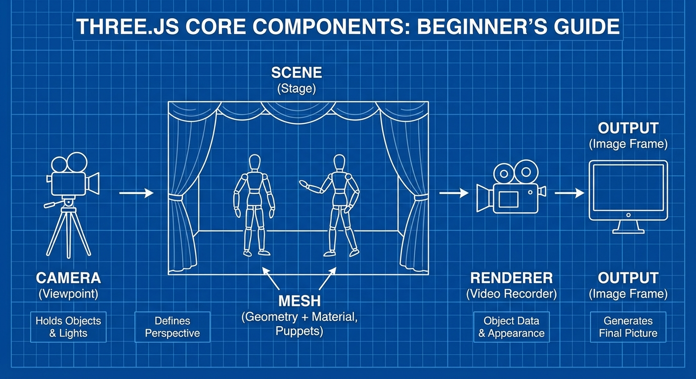
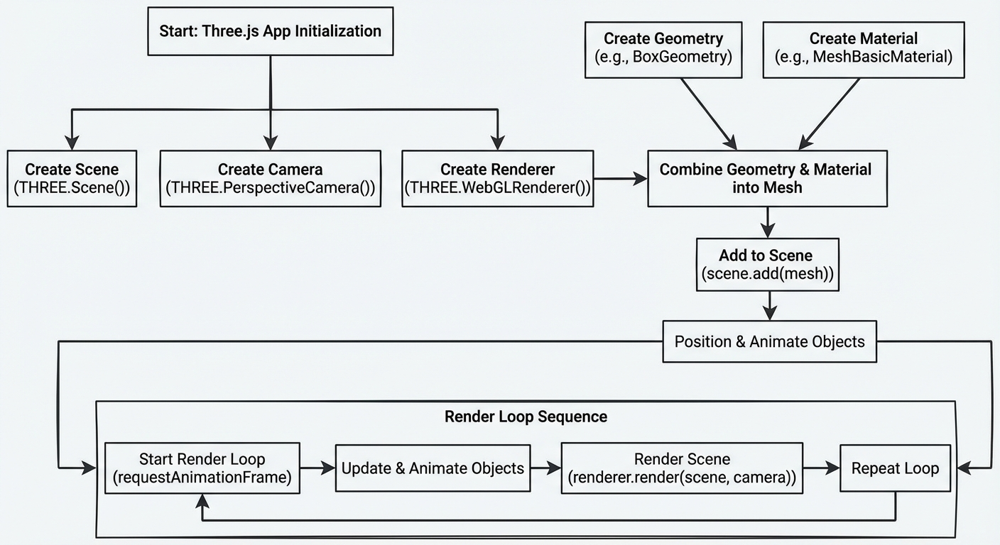

# Complete three.js Mastery from Zero to Pro

## Introduction to Three.js and 3D Graphics Basics

3D computer graphics create images that represent three-dimensional objects on a flat screen. Unlike 2D graphics, which only have height and width, 3D graphics add depth, making scenes look more realistic and interactive. Today, 3D graphics matter a lot in web experiencesthe virtual tours, interactive product showcases, games, and simulations you use right in your browser. They make web pages visually richer and more engaging.

Three.js is a popular JavaScript library designed to simplify creating these 3D graphics on the web. It builds on top of WebGL, which is a powerful but complex technology that allows browsers to use your computer9s graphics card to render 3D scenes. Instead of writing long and complicated WebGL code, Three.js provides easy-to-use building blocks for creating and displaying 3D content quickly.

Let9s cover some key terms you9ll see in most Three.js projects:

- **Scene**: Think of this as the "stage" where all the 3D objects are placed. It holds everything you want to display.
- **Camera**: Imagine a camera or a viewpoint through which you look at the scene. It defines what you see and how you see it.
- **Mesh**: This is a 3D object made by combining two parts: geometry and material.
- **Geometry**: The shape or structure of the object, like a cube, sphere, or custom model.
- **Material**: The surface look of the geometry it9s color, texture, shininess, and how it reacts to light.
- **Renderer**: The tool that draws everything onto the screen, turning the 3D scene into a 2D image you can see.

### Visual Analogy

Imagine you are filming a puppet show:

- The **Scene** is the stage where puppets perform.
- The **Camera** is your video camera deciding what angle and zoom to record from.
- Each **Mesh** is a puppet, made by the puppet9s shape (**Geometry**) and costume or paint (**Material**).
- The **Renderer** is the video recorder that captures the show so the audience sees it on their screens.


*Basic Three.js Components: Scene, Camera, Mesh, Geometry, Material, and Renderer visual analogy.*

### Minimal Three.js Example with a Cube

Here9s a simple code snippet to create a basic 3D scene with a spinning cube using Three.js. This will help you see how the concepts come together:

```javascript
// Import Three.js (if using modules) or include via script tag in HTML

// 1. Create the scene (our "stage")
const scene = new THREE.Scene();

// 2. Set up a camera (our "viewpoint")
const camera = new THREE.PerspectiveCamera(
  75,                // Field of view
  window.innerWidth / window.innerHeight,  // Aspect ratio
  0.1,               // Near clipping plane
  1000               // Far clipping plane
);
camera.position.z = 5; // Move camera away from origin

// 3. Create geometry (a box shape)
const geometry = new THREE.BoxGeometry(1, 1, 1);

// 4. Create material (simple color)
const material = new THREE.MeshBasicMaterial({ color: 0x00ff00 });

// 5. Combine geometry and material into a mesh (cube)
const cube = new THREE.Mesh(geometry, material);

// 6. Add cube to the scene
scene.add(cube);

// 7. Create a renderer and attach it to the document
const renderer = new THREE.WebGLRenderer();
renderer.setSize(window.innerWidth, window.innerHeight);
document.body.appendChild(renderer.domElement);

// 8. Animation loop to render and rotate the cube
function animate() {
  requestAnimationFrame(animate);

  cube.rotation.x += 0.01; // Rotate cube on X axis
  cube.rotation.y += 0.01; // Rotate cube on Y axis

  renderer.render(scene, camera); // Draw scene from camera's view
}
animate();
```

### Debugging Tips and Edge Cases

- If your cube doesn9t appear, check that your camera is positioned to see the objectyou often need to move the camera back along the Z-axis.
- Resize the renderer on window size changes to avoid stretched or blank canvases.
- Use browser console errors to catch typos like misspelling `MeshBasicMaterial` or forgetting to add objects to the scene.
- Performance-wise, keep mesh counts low and reuse geometries/materials where possible to keep the scene snappy.

---

### Recap

- 3D graphics add depth and realism to web content.
- Three.js simplifies WebGL for easier, faster 3D web development.
- The basic structure includes scene, camera, mesh (geometry + material), and renderer.
- A small cube example ties these pieces together visually and code-wise.
- Simple checks ensure your scene renders correctly and efficiently.

## Setting Up Your Development Environment for Three.js

Before diving into Three.js, you need the right tools to create and run your 3D projects smoothly.

### Tools You Need

- **Code Editor:** This is where you write your HTML, CSS, and JavaScript code. Popular free options include [Visual Studio Code (VSCode)](https://code.visualstudio.com/) or [Sublime Text](https://www.sublimetext.com/).
- **Local Server:** Browsers often block some features when you open files directly from your computer, so a simple local server lets you run your project as if it9s on the internet.
- **Browser with Developer Tools:** Modern browsers like Chrome and Firefox have built-in developer tools to view console messages, inspect elements, and debug your code.

### Installing Three.js

You can include Three.js in your project in two main ways:

1. **Using npm (Node Package Manager):** If you have Node.js installed, run this command in your project folder terminal:

   ```
npm install three
```

   This downloads the Three.js library locally for your project.

2. **Using a CDN (Content Delivery Network):** Add this script tag inside your HTML `<head>` or before closing `<body>`:

   ```html
<script src="https://cdn.jsdelivr.net/npm/three@0.182.0/build/three.min.js"></script>
```

   This loads Three.js directly from the web.

### Creating Your Project Files

Start with three basic files in a new folder:

- `index.html` your main HTML page
- `style.css` your CSS for styling
- `app.js` your JavaScript with Three.js code

Minimal `index.html` example:

```html
<!DOCTYPE html>
<html lang="en">
<head>
  <meta charset="UTF-8" />
  <title>Three.js Project</title>
  <link rel="stylesheet" href="style.css" />
</head>
<body>
  <script src="app.js"></script>
</body>
</html>
```

### Running Your Project Locally

You need to serve your folder on a local server:

- **Using VSCode Live Server:**  
  Open your project folder in VSCode. Right-click `index.html`  *Open with Live Server*. This opens your project in a browser with live reloading.

- **Using `live-server` (Node.js tool):**  
  Install with `npm install -g live-server`, then run `live-server` in your project folder terminal. It opens your browser and refreshes on file changes.

### Using Browser Developer Tools

Press `F12` or right-click the page and select *Inspect* to open developer tools. Key features:

- **Console tab:** See errors, warnings, and `console.log()` outputs. It helps find issues in your Three.js code.
- **Elements tab:** Inspect and edit HTML and CSS live.
- **Sources tab:** Debug JavaScript line-by-line; set breakpoints.

### Debugging Tips & Edge Cases

- If your scene shows a black screen, check the console for errors.
- Remember to include a camera and light in your scene; missing these often causes nothing to render.
- Use local servers instead of opening files directly to avoid resource loading issues.
- Clear browser cache if updates don9t appear immediately.

### Performance Considerations

Starting simple helps ensure your setup works before adding complex 3D objects. Using the CDN is fast for quick tests; npm is better for larger projects with bundlers.

---

**Recap:**

- Use a code editor, local server, and modern browser with dev tools.
- Install Three.js via npm or CDN.
- Create minimal HTML, CSS, and JS files.
- Run projects with Live Server or similar local servers.
- Debug with browser developer tools early and often to catch errors.

## Building Basic Three.js Scenes and Objects

When starting with Three.js, the first step is to create a **scene**this is like your 3D world or stage where everything happens. You add objects, lights, and cameras to this scene. Think of the scene as the container holding all your 3D elements.

### Creating the Scene, Camera, and Renderer

- **Scene**: The container for your 3D objects.
- **Camera**: Determines what part of the scene you can see. The most common is a **PerspectiveCamera**, which simulates the way the human eye sees the world, with objects appearing smaller as they are further away.
- **Renderer**: The tool that draws your scene onto the webpage. Three.js uses a **WebGLRenderer** to display high-performance 3D graphics.

Here9s a simple setup:

```javascript
// Create a scene
const scene = new THREE.Scene();

// Create a camera with fov = 75, aspect ratio = width/height, near=0.1, far=1000
const camera = new THREE.PerspectiveCamera(
  75, 
  window.innerWidth / window.innerHeight, 
  0.1, 
  1000
);

// Create a renderer and add it to the HTML document
const renderer = new THREE.WebGLRenderer();
renderer.setSize(window.innerWidth, window.innerHeight);
document.body.appendChild(renderer.domElement);
```

### Building Basic 3D Objects

Three.js provides geometric shapes called **geometries** you can use to create objects. Some common primitives are:

- **BoxGeometry**: A rectangular box (cuboid).
- **SphereGeometry**: A sphere or ball.

To see these objects, you combine a geometry with a **material** to create a **mesh**. The mesh is what gets drawn on the screen.

```javascript
// Create a box geometry (width, height, depth)
const geometry = new THREE.BoxGeometry(1, 1, 1);

// Create a basic material with color
const material = new THREE.MeshBasicMaterial({ color: 0x00ff00 });

// Combine geometry and material into a mesh
const cube = new THREE.Mesh(geometry, material);

// Add the cube to the scene
scene.add(cube);
```

### Positioning, Scaling, and Rotating Objects

Once your object is in the scene, you can move it around, change its size, or spin it.

- **Position**: Move object on x, y, z axes.
- **Scale**: Increase or decrease object size.
- **Rotation**: Rotate object around axes (in radians).

```javascript
// Move cube 2 units right, 1 unit up, and 0 units forward
cube.position.set(2, 1, 0);

// Double the size of the cube
cube.scale.set(2, 2, 2);

// Rotate the cube 45 degrees (PI/4 radians) around Y axis
cube.rotation.y = Math.PI / 4;
```

Common mistakes include mixing degrees and radians (Three.js uses radians) and forgetting to update the renderer when objects change.

### Rendering and Basic Animation Loop

To see your scene on the screen, you render it using your renderer and camera. To make your scene interactive or animated, you use an **animation loop** that redraws the scene repeatedlytypically 60 times per second.

Here9s a minimal example of an animation loop that spins the cube:

```javascript
function animate() {
  requestAnimationFrame(animate); // Schedule next frame

  // Rotate cube a bit each frame for animation
  cube.rotation.x += 0.01;
  cube.rotation.y += 0.01;

  // Render the scene from the camera9s perspective
  renderer.render(scene, camera);
}

// Set camera position so we can see the cube
camera.position.z = 5;

// Start the animation loop
animate();
```

### Debugging Tips and Edge Cases

- If nothing appears, check that the camera is positioned correctly to see your objects.
- Verify your objects are inside the camera9s **near and far clipping planes** (0.1 to 1000 in the example).
- If the scene is empty or black, check lighting or material setups (MeshBasicMaterial does not require lights).
- Resize your renderer on window resize to avoid distortion.

### Performance Considerations

- Keep your geometry simple when starting to improve performance.
- Avoid creating new geometries or materials inside the animation loop.
- Use **requestAnimationFrame** for efficient animations synchronized to the screen refresh rate.

---

**Recap:**

- Create a **Scene**, **PerspectiveCamera**, and **WebGLRenderer** to start.
- Build objects using **Geometry + Material = Mesh**.
- Move, scale, and rotate objects by modifying `position`, `scale`, and `rotation`.
- Use an animation loop with `requestAnimationFrame` for interactivity.
- Watch for common issues like camera placement and clipping planes.

This foundation sets you up to explore more complex Three.js features confidently!


*Workflow diagram illustrating the creation of a Three.js scene: initializing Scene, Camera, Renderer, adding Geometry + Material = Mesh, positioning, and animation loop.*

## Lighting, Shadows, and Materials: Making Your Scene Realistic

Achieving realism in your three.js scene hinges largely on effective use of lighting and materials. Lights define how objects appear, casting brightness and shadows that mimic the real world. Materials determine how surfaces respond to that light, whether they look shiny, matte, or emissive. Let9s explore essential light types, materials, and shadows, with practical tips and code.

### Types of Lights in three.js

1. **AmbientLight**  
   This is a non-directional, uniform light that illuminates objects equally from all sides. It adds general brightness but does not produce shadows or highlights. Use it to simulate indirect light or soften scenes.

2. **DirectionalLight**  
   Behaves like sunlight: parallel rays shining in one direction. It9s great for casting shadows and creating strong highlights. Position and aim it carefully to simulate a sun or spotlight far away.

3. **PointLight**  
   Emits light equally in all directions from a specific point, like a light bulb. Intensities decay over distance, so you can simulate lamps or candles.

4. **SpotLight**  
   Like a PointLight but constrained within a cone, with controls for angle and penumbra (softness of edge). This is useful for flashlights or stage lights.

### Materials and Their Response to Light

- **MeshBasicMaterial:**  
  This material ignores lighting completely. Surfaces rendered with it appear flat and unshadedgood for simple colors or debugging.

- **Physically Based Materials (e.g., MeshStandardMaterial, MeshPhysicalMaterial):**  
  These respond dynamically to light, simulating realistic interactions like reflections and roughness. For example, metal surfaces look shiny and specular, while rough surfaces scatter light diffusely.

### Enabling Shadows

To create shadows:

1. Enable shadows in your renderer:  
   ```js
   renderer.shadowMap.enabled = true;
   ```

2. For lights that cast shadows (DirectionalLight, SpotLight, PointLight), set:  
   ```js
   light.castShadow = true;
   ```

3. For objects:  
   - Enable receiving shadows:  
     ```js
     mesh.receiveShadow = true;
     ```  
   - Enable casting shadows:  
     ```js
     mesh.castShadow = true;
     ```

4. Carefully configure shadow properties for quality and performance:  
   - Adjust `shadow.mapSize` for resolution (higher = better but costlier).  
   - Set `shadow.camera` parameters (for DirectionalLight) to control shadow frustum size and reduce artifacts.

### Common Pitfalls and Edge Cases

- **No Shadows Visible:**  
  Often caused by forgetting `castShadow` or `receiveShadow` flags or not enabling shadows on the renderer.

- **Shadow Acne (dark spots) or Peter Panning (floating shadows):**  
  Tweak bias values (`light.shadow.bias`) to reduce these artifacts.

- **Performance Costs:**  
  High shadow resolution and many shadow-casting lights impact performance. Use minimal shadow-casting lights and optimize shadow camera bounds.

- **Materials Ignoring Lighting:**  
  Using `MeshBasicMaterial` or similar materials without lighting will make shadows and highlights invisible.

### Example: A Lit Scene with Shadows

```js
import * as THREE from 'three';

// Set up scene and camera
const scene = new THREE.Scene();
const camera = new THREE.PerspectiveCamera(70, window.innerWidth/window.innerHeight, 0.1, 100);
camera.position.set(5, 5, 5);
camera.lookAt(0, 0, 0);

const renderer = new THREE.WebGLRenderer({ antialias: true });
renderer.setSize(window.innerWidth, window.innerHeight);
renderer.shadowMap.enabled = true;
document.body.appendChild(renderer.domElement);

// Add ground plane
const planeGeometry = new THREE.PlaneGeometry(10, 10);
const planeMaterial = new THREE.MeshStandardMaterial({ color: 0x808080 });
const plane = new THREE.Mesh(planeGeometry, planeMaterial);
plane.rotation.x = -Math.PI / 2;
plane.receiveShadow = true;
scene.add(plane);

// Add a sphere that casts shadow
const sphereGeometry = new THREE.SphereGeometry(1, 32, 32);
const sphereMaterial = new THREE.MeshStandardMaterial({ color: 0x0077ff, metalness: 0.6, roughness: 0.3 });
const sphere = new THREE.Mesh(sphereGeometry, sphereMaterial);
sphere.position.set(0, 1, 0);
sphere.castShadow = true;
scene.add(sphere);

// Add lights
const ambientLight = new THREE.AmbientLight(0xffffff, 0.3);
scene.add(ambientLight);

const directionalLight = new THREE.DirectionalLight(0xffffff, 1);
directionalLight.position.set(5, 10, 5);
directionalLight.castShadow = true;
directionalLight.shadow.mapSize.width = 1024;
directionalLight.shadow.mapSize.height = 1024;
directionalLight.shadow.camera.near = 1;
directionalLight.shadow.camera.far = 20;
directionalLight.shadow.camera.left = -5;
directionalLight.shadow.camera.right = 5;
directionalLight.shadow.camera.top = 5;
directionalLight.shadow.camera.bottom = -5;
directionalLight.shadow.bias = -0.001;
scene.add(directionalLight);

// Animation loop
function animate() {
  requestAnimationFrame(animate);
  sphere.rotation.y += 0.01;
  renderer.render(scene, camera);
}
animate();
```

### Recap

- Use **AmbientLight** for general brightness, **DirectionalLight** for sun-like illumination, **PointLight** for omni-directional lamps, and **SpotLight** for focused beams.
- Materials like **MeshStandardMaterial** respond well to light, unlike **MeshBasicMaterial**, which ignores light.
- Enable and configure shadows carefully with `castShadow` and `receiveShadow` flags.
- Debug shadow issues by tweaking bias and shadow camera settings.
- Balance shadow resolution and number of lights for good performance.

Understanding these concepts lets you build realistic, visually rich three.js scenes that respond dynamically to light and shadow. For further guidance, explore the official docs and practical examples ([Source](https://threejs.org/), [Source](https://medium.com/@ankitakanchan97/learning-three-js-in-2024-a-fun-and-easy-way-to-creating-3d-experiences-3f465801b171)).

## Animating Scenes and Handling User Interaction

When creating dynamic 3D scenes in Three.js, smooth animations and responsive user interactions bring your project to life. This section covers how to build animation loops, animate object properties, use built-in controls, and handle events like mouse and keyboard inputs. Additionally, we9ll discuss debugging tips and performance considerations.

### Using `requestAnimationFrame` for Animation Loops

At the core of animation in Three.js is the browser API `requestAnimationFrame`. It schedules a function to be called before the next repaint, ensuring smooth updates synced with the display refresh rate (usually ~60 frames per second). This prevents running your animation too fast or too slow.

A typical loop looks like this:

```js
function animate() {
  requestAnimationFrame(animate); // Schedule next frame

  // Update animations, object properties, controls here

  renderer.render(scene, camera); // Render the scene from the camera's view
}

animate(); // Start the loop
```

This loop pattern is essential. If you forget to call `requestAnimationFrame` again inside `animate()`, the animation will stop.

### Animating Object Properties: Position, Rotation, and Scale

You animate objects in Three.js by changing their properties over time inside the animation loop. The most common properties are:

- **position**: moves the object in 3D space (`object.position.x`, `.y`, `.z`)
- **rotation**: rotates the object around axes (`object.rotation.x`, `.y`, `.z` in radians)
- **scale**: resizes the object (`object.scale.x`, `.y`, `.z`)

Example: rotating a cube continuously on its Y-axis:

```js
function animate() {
  requestAnimationFrame(animate);

  cube.rotation.y += 0.01; // Increment rotation by 0.01 radians per frame

  renderer.render(scene, camera);
}
```

Remember to keep increments small for smooth motion. Large jumps cause jerky animation.

### Introducing Three.js Controls: OrbitControls for Camera Interaction

Three.js provides useful controls in the `examples/jsm/controls/` folder, notably `OrbitControls`. It allows intuitive camera interaction using mouse or touch:

- Drag to orbit around the target
- Scroll to zoom in/out
- Right-click or two-finger drag to pan

To add OrbitControls:

```js
import { OrbitControls } from 'three/examples/jsm/controls/OrbitControls.js';

const controls = new OrbitControls(camera, renderer.domElement);
controls.update();
```

You typically call `controls.update()` inside your animation loop to enable smooth damping (inertia). Without this, camera movement may feel abrupt.

### Event Handling: Mouse and Keyboard Inputs

For richer interactions, listen for browser events on your canvas or document:

```js
window.addEventListener('keydown', (event) => {
  if (event.key === 'w') {
    // Move object forward on 'w' press
    cube.position.z -= 0.1;
  }
});

renderer.domElement.addEventListener('click', (event) => {
  console.log(`Mouse clicked at (${event.clientX}, ${event.clientY})`);
});
```

Use these events to implement controls like moving objects, triggering animations, or changing materials.

### Debugging Tips for Animation and Performance

- **Animation glitches**:  
  - Check that `requestAnimationFrame` is called every frame.
  - Avoid large sudden property changesuse smaller increments.
- **Performance bottlenecks**:
  - Profile FPS in browser devtools; stuck or low FPS means heavy computation.
  - Limit number of objects and complex calculations inside the animation loop.
  - Use simplified geometries or lower texture resolutions if needed.
- **Controls jitter**:
  - Ensure you call `controls.update()` every frame if damping is enabled.
- **Memory leaks**:
  - Dispose of geometries, materials, and textures when removing objects.

### Edge Cases and Performance Considerations

- Avoid animating too many objects individually; consider grouping or instancing.
- When animating based on time, prefer using `clock.getElapsedTime()` from `THREE.Clock` for frame-rate independent motion.
- For complex interactions, debounce or throttle event handlers to maintain smooth FPS.
- Consider using GPU-accelerated shaders for heavy effects rather than CPU-side animations.

---

**Recap:**  
- Use `requestAnimationFrame` to create smooth loops.  
- Animate objects by updating position, rotation, and scale gradually.  
- Add camera control with `OrbitControls` for interactive views.  
- Handle user input with event listeners for keyboard and mouse.  
- Debug animations by checking loop calls, using profiling tools, and managing resources.

Mastering these basics allows you to build engaging, responsive 3D experiences with Three.js. For further examples and techniques, explore official resources and community tutorials ([Source](https://threejs.org/), [Medium](https://medium.com/@ankitakanchan97/learning-three-js-in-2024-a-fun-and-easy-way-to-creating-3d-experiences-3f465801b171)).

## Working with 3D Models and Textures

When building 3D scenes in Three.js, importing external 3D models with textures is a common task. This section covers essential concepts, practical tips, and a minimal example for loading and enhancing models.

### Supported Model Formats and Importance of glTF

Three.js supports several 3D model formats via different loaders:

- **OBJ**: Simple geometry, no animation or PBR materials by default.
- **FBX**: Supports animation; proprietary and less web-friendly.
- **Collada (DAE)**: XML format, somewhat outdated.
- **glTF (GL Transmission Format)**: The modern industry standard for web and real-time applications.

The **glTF format** is lightweight, JSON-based, supports PBR (Physically Based Rendering) materials, animations, and textures packed efficiently. glTF minimizes loading time and runtime parsingkey for smooth performance on the web ([learn more](https://threejs.org/docs/index.html#examples/en/loaders/GLTFLoader)).

### Loading Models with GLTFLoader

Three.js provides `GLTFLoader` to fetch and import `.gltf` or `.glb` (binary glTF) files asynchronously. Because loading external files can take time, the process uses callbacks or Promises to react when loading completes.

**Key points:**

- Use `new GLTFLoader().load()` to load models.
- Provide callbacks for success, progress, and error handling.
- The loaded model is accessible inside the callback and can be added to the Three.js scene.

```js
import { GLTFLoader } from 'three/examples/jsm/loaders/GLTFLoader.js';

const loader = new GLTFLoader();
loader.load(
  'models/model.glb',
  (gltf) => {
    scene.add(gltf.scene); // Add loaded model to scene
  },
  (xhr) => {
    console.log(`${(xhr.loaded / xhr.total * 100).toFixed(2)}% loaded`); // Progress info
  },
  (error) => {
    console.error('Error loading model:', error);
  }
);
```

### Applying Textures, Normal Maps, and Environment Maps

Once the model is loaded, you can manipulate its materials to enhance realism:

- **Textures**: Image maps that define surface colors and details.
- **Normal maps**: Add surface bumps and intricate light effects without extra polygons.
- **Environment maps**: Reflective maps simulating surrounding environments for shininess.

Applying a texture often involves replacing or augmenting the existing material maps. For example:

```js
import { TextureLoader } from 'three';

const textureLoader = new TextureLoader();
const texture = textureLoader.load('textures/diffuse.jpg');
const normalMap = textureLoader.load('textures/normal.jpg');
const envMap = textureLoader.load('textures/env.jpg');

gltf.scene.traverse((child) => {
  if (child.isMesh) {
    child.material.map = texture;         // Color texture
    child.material.normalMap = normalMap; // Normal map for surface detail
    child.material.envMap = envMap;       // Environment reflection
    child.material.needsUpdate = true;    // Apply changes
  }
});
```

### Common Issues and Debugging Tips

- **Model scale**: Models may appear too large or too small in your scene. Sometimes exported units differ. Use `gltf.scene.scale.set(x, y, z)` to fix scale.
- **Orientation problems**: Models might be rotated incorrectly due to differing coordinate systems. Try `gltf.scene.rotation.set(x, y, z)` or use model export settings accordingly.
- **Missing textures**: Ensure texture paths are correct and hosted or served properly; otherwise, textures won9t load.
- **Performance pitfalls**:
  - Large textures and models can slow rendering.
  - Minimize texture size and compress models where possible.
  - Use Draco compression with GLTFLoader for smaller file sizes if supported.
- **Material issues**: Some complex materials may need tweaking or replacing in Three.js for consistent visuals.

Use browser developer tools to watch network requests and console errors. The Three.js Inspector ([Needle Tools](https://needle.tools/needle-inspector-devtools-for-threejs)) can help visualize scene and material structures during debugging.

### Minimal Example: Loading a glTF Model with Textures

```js
import * as THREE from 'three';
import { GLTFLoader } from 'three/examples/jsm/loaders/GLTFLoader.js';

// Setup scene, camera, renderer
const scene = new THREE.Scene();
const camera = new THREE.PerspectiveCamera(50, window.innerWidth/window.innerHeight, 0.1, 1000);
camera.position.set(0, 1.6, 3);
const renderer = new THREE.WebGLRenderer({ antialias: true });
renderer.setSize(window.innerWidth, window.innerHeight);
document.body.appendChild(renderer.domElement);

// Lights
const light = new THREE.HemisphereLight(0xffffff, 0x444444, 1);
scene.add(light);

// Load Model
const loader = new GLTFLoader();
const textureLoader = new THREE.TextureLoader();

loader.load(
  'models/scene.glb',
  (gltf) => {
    const model = gltf.scene;

    const texture = textureLoader.load('textures/diffuse.jpg');
    const normalMap = textureLoader.load('textures/normal.jpg');
    const envMap = textureLoader.load('textures/env.jpg');

    model.traverse((child) => {
      if (child.isMesh) {
        child.material.map = texture;
        child.material.normalMap = normalMap;
        child.material.envMap = envMap;
        child.material.needsUpdate = true;
      }
    });

    model.scale.set(1, 1, 1);
    scene.add(model);
  },
  undefined,
  (error) => console.error(error)
);

function animate() {
  requestAnimationFrame(animate);
  renderer.render(scene, camera);
}

animate();
```

---

### Recap

- glTF is the modern standard for 3D models in Three.js.
- Use GLTFLoader to load models asynchronously, handling loading progress and errors.
- Apply textures, normal maps, and environment maps by traversing meshes in the loaded model.
- Watch for scale, orientation, texture loading issues, and optimize for performance.
- Use debugging tools and inspect network logs for troubleshooting.

Mastering these foundational steps will empower you to integrate rich, textured 3D models smoothly into your Three.js projects ([source](https://medium.com/@gianluca.lomarco/7-tools-and-resources-for-your-3d-projects-in-three-js-4cb16daeaeec)).

## Debugging, Performance Optimization, and Edge Cases

When working with Three.js, debugging and optimizing performance are crucial skills to keep your 3D scenes running smoothly across devices. Let9s explore key tools and techniques to help you manage common errors, boost efficiency, and handle trickier edge cases.

### Debugging with Browser Devtools and Three.js Inspector

Start debugging your Three.js scenes by leveraging built-in browser developer tools (Devtools). The Console tab helps catch JavaScript errors and warnings, while the Network tab tracks asset loading times and failuresboth essential for fast problem detection.

For deeper scene inspection, use **Three.js Inspector** ([Needle Tools](https://needle.tools/needle-inspector-devtools-for-threejs)). This browser extension allows you to:

- View and manipulate the scene graph hierarchy in real time.
- Inspect object properties such as position, rotation, and materials.
- Detect rendering issues by toggling visibility and changing parameters on the fly.

If your scene appears blank or objects disappear, check that cameras and lights are enabled and properly positioned. Devtools9 **Element picker** can help verify canvas rendering and overlay elements.

### Memory Management and Resource Cleanup

Three.js apps often create many GPU resources: geometries, textures, materials, and more. If these aren9t properly disposed, they cause **memory leaks** that degrade performance over time.

Key practices:

- Call `.dispose()` on geometries, materials, and textures when no longer needed.  
- Remove event listeners tied to objects to prevent dangling references.  
- Clear scenes of removed meshes to free GPU memory.  

Example:  
```javascript
geometry.dispose();
material.dispose();
texture.dispose();
scene.remove(mesh);
mesh.geometry = null;
mesh.material = null;
```

Regularly monitor browser memory profiles to detect leaks and ensure cleanup is effective.

### Reducing Draw Calls and Optimizing Render Loops

**Draw calls** are instructions sent from the CPU to the GPU to render objects. Each separate mesh typically means one draw call. Too many draw calls slow rendering, especially on weaker devices.

Common optimizations:

- **Merge geometries** where possible using `BufferGeometryUtils.mergeBufferGeometries()`, reducing draw calls by rendering multiple objects as one.  
- Use **instanced meshes** for repeated objects (e.g., trees, particles) that share geometry and material but differ in transforms.  
- Optimize your **render loop** by avoiding unnecessary renders. Use `requestAnimationFrame` wisely and only update the scene when changes occur.

Example render loop improvement:  
```javascript
function animate() {
  if(sceneChanged) {
    renderer.render(scene, camera);
    sceneChanged = false;
  }
  requestAnimationFrame(animate);
}
```

### Handling Edge Cases: Device Differences and WebGL Context Loss

Three.js runs on WebGL, which behaves differently across devices and browsers. Some tricky edge cases:

- **WebGL context loss** can happen due to GPU resets or tab switching. Listen for `webglcontextlost` and `webglcontextrestored` events on your canvas to recreate resources if needed.  
- **Device pixel ratios** differ. Ensure your renderer9s pixel ratio adapts by calling `renderer.setPixelRatio(window.devicePixelRatio)`.  
- Be mindful of **mobile limitations**: lower GPU power, limited memory, and frequent context loss require more aggressive optimization.  

### Example Fixes for Common Errors and Performance Issues

- **Scene shows black screen:** Check camera position & direction; add basic lighting; verify render calls.  
- **Textures not loading:** Confirm URLs are correct; watch for CORS errors in Devtools Console.  
- **Memory leak detected:** Dispose obsolete geometries and materials; remove objects from scene and null references.  
- **Slow frame rate:** Use merged or instanced geometries; reduce texture sizes; minimize draw calls; throttle render loop.

---

### Recap

- Use **browser Devtools** and **Three.js Inspector** to explore scene hierarchy and track errors in runtime.  
- Always **dispose** of unused geometries, materials, and textures to prevent memory leaks.  
- Optimize rendering by **reducing draw calls** and carefully managing your render loop.  
- Handle **edge cases** like WebGL context loss and device differences to avoid unexpected crashes or slowdowns.  
- Address common problems by verifying camera setup, asset loading, and resource cleanup.

Mastering these debugging and optimization strategies will ensure your Three.js projects are performant, stable, and adaptable across platforms.

For deeper reading on tools and performance tips, check out these resources:  
- [7 Tools and Resources for Your 3D Projects in Three.js](https://medium.com/@gianluca.lomarco/7-tools-and-resources-for-your-3d-projects-in-three-js-4cb16daeaeec)  
- [Three.js Inspector, Devtools & Editor - Needle Tools](https://needle.tools/needle-inspector-devtools-for-threejs)  
- [100 Three.js Tips That Actually Improve Performance (2026) - Utsubo](https://www.utsubo.com/blog/threejs-best-practices-100-tips)

## Advanced Topics: Custom Shaders, Post-Processing, and Architectural Patterns

As you move into professional-grade Three.js development, mastering advanced techniques is essential. This section covers key concepts that elevate your 3D applications in flexibility, visual quality, and maintainability.

### GLSL Shaders and ShaderMaterial

GLSL (OpenGL Shading Language) is a small programming language that runs on your graphics card to control how vertices and pixels get rendered. Shaders allow you to customize the look and behavior of materials beyond built-in options.

In Three.js, you use `ShaderMaterial` to write custom shaders. This lets you define *vertex shaders* (controlling geometry positions) and *fragment shaders* (controlling pixel colors). For example, you might create glowing surfaces, procedural textures, or animated effects.

**Debugging tip:** Start with simple shaders that modify only color or position. Use browser developer tools or tools like [Shader Editor](https://threejs.org/examples/webgl_shadereditor.html) to test and step through shader code since GLSL errors can be silent.

### Common Post-Processing Effects

Post-processing applies image effects after rendering the scene, enhancing realism or stylizing visuals:

- **Bloom:** Adds a glow around bright areas, simulating how cameras or eyes perceive intense light.
- **Depth of Field (DoF):** Blurs objects outside the focus range, mimicking camera lens focus.
- **Screen Space Ambient Occlusion (SSAO):** Adds subtle shadows in creases and near contact points for perceived depth.

In Three.js, these effects are implemented via *passes* in the `EffectComposer`, chaining multiple rendering steps. Post-processing can be costly; toggle effects depending on device capabilities.

### Architectural Best Practices: Component-Based Scene Management

Organizing your Three.js app as modular components improves clarity and scalability. Here9s how:

- **Encapsulate** mesh creation, materials, and logic into reusable classes or functions.
- **Manage state** separately from rendering (e.g., keep physics, user input, and animation logic distinct).
- Use **scene graph hierarchy** meaningfullygroup related objects (like characters or UI elements).
- Consider **event-driven communication** between components for loose coupling.

This approach simplifies debugging, testing, and extending your application.

### Tradeoffs: Performance vs. Maintainability

Advanced features often add complexity and affect performance:

- Custom shaders and post-processing improve visuals but increase GPU load.
- Rich scene graphs and modular code improve maintainability but may add overhead if not optimized.
- Profile regularly and balance feature sets depending on your target audience and devices.

For example, mobile devices may struggle with expensive shaders or multiple post-processing effects. Use profiling tools like Chrome DevTools or the Three.js Inspector ([Needle Tools](https://needle.tools/needle-inspector-devtools-for-threejs)) to find bottlenecks.

### Further Resources

To deepen your skills, explore:

- The official [Three.js documentation and examples](https://threejs.org/)
- Medium articles like [Top 10 Advanced Three.js Tricks for 2024](https://medium.com/@AALA-IT-Solutions/top-10-advanced-three-js-tricks-for-2024-56fd065aed07)
- Open-source projects on GitHub for real-world designs ([n1k02/three-js-projects](https://github.com/n1k02/three-js-projects))
- Community tutorials and source code on DEV and Medium for practical tips ([Learning Three.js in 2024](https://medium.com/@ankitakanchan97/learning-three-js-in-2024-a-fun-and-easy-way-to-creating-3d-experiences-3f465801b171))

---

**Recap:**

- GLSL shaders let you customize geometry and materials; use `ShaderMaterial` and debug carefully.
- Post-processing effects like bloom and SSAO enhance realism but impact performance.
- Architect your app with modular components and clear scene hierarchies for easier maintenance.
- Balance performance and features; profile frequently on different devices.
- Use official docs and community projects to continue learning advanced Three.js techniques.