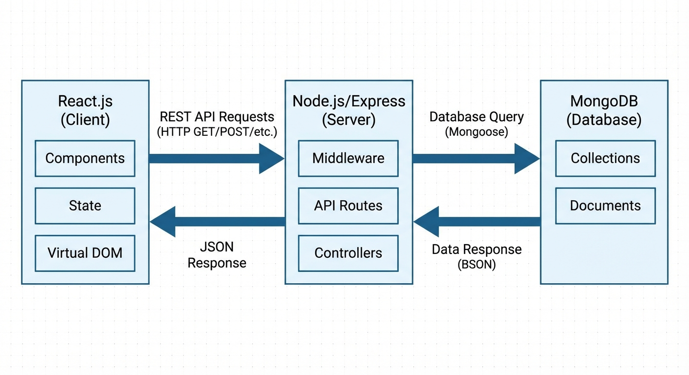
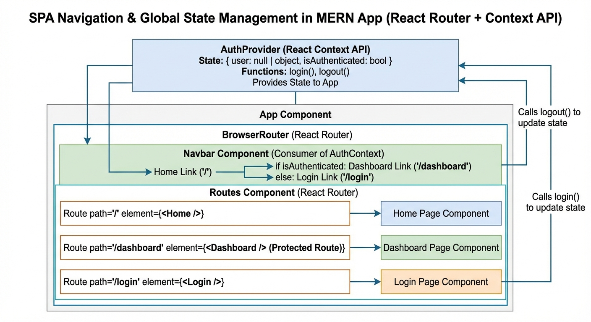
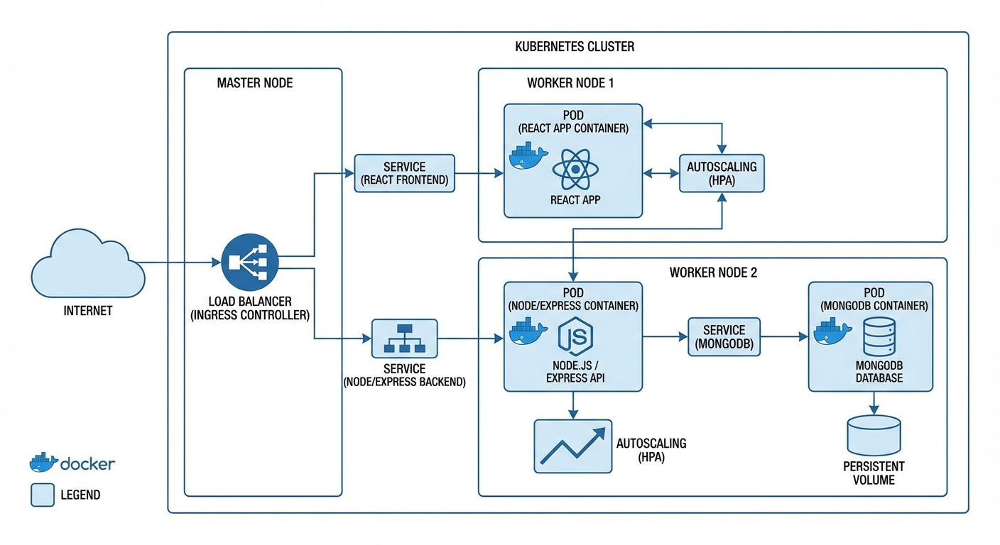

# The Complete MERN Stack Developer Guide: From Refresher to Production-Ready Architect

## Understanding the MERN Stack Architecture and Core Terminology

The MERN stack is a popular full-stack JavaScript framework used to build modern web applications. It consists of four key components: **MongoDB**, **Express.js**, **React.js**, and **Node.js**. Here’s a quick refresher on what each does:

- **MongoDB**: A NoSQL database that stores data in flexible, JSON-like documents. Its schema-less nature allows easy iteration during development.
- **Express.js**: A lightweight web application framework that runs on Node.js, simplifying backend development by handling routing, middleware, and HTTP requests.
- **React.js**: A frontend JavaScript library focused on building interactive user interfaces using reusable components and efficient rendering.
- **Node.js**: A runtime environment to execute JavaScript on the server side, enabling a unified language across both client and server.

### Role and Interaction Flow

A typical MERN app works as follows: React.js runs on the client (browser), rendering dynamic views and capturing user events. It communicates with Express.js/Node.js on the server via **REST APIs** — endpoints that respond to HTTP requests (GET, POST, etc.). Express.js processes these requests, interacts with MongoDB to fetch or update data asynchronously, then sends JSON responses back to React for UI updates.


*Architecture and interaction flow of MERN stack components: React frontend, Express/Node server, and MongoDB database exchanging data via REST APIs.*

### Core Terms to Know

- **REST APIs**: A design pattern for web services where clients request resources via URLs and HTTP methods. It decouples frontend and backend.
- **State Management**: The technique to track and update the status/data of an application’s UI and logic; in React, state controls what’s displayed and how the app behaves.
- **Middleware**: Functions in Express.js placed between request and response that modify or act upon data (e.g., authentication, logging).
- **Asynchronous Programming**: JavaScript handles operations (like DB queries) without blocking the app's flow, using promises or async/await to wait for responses.

### Modern Extensions

While traditional MERN stacks use REST APIs, many projects now incorporate **serverless functions**—small, event-driven backend logic hosted on cloud platforms. Similarly, **edge computing** pushes part of the backend closer to users geographically, reducing latency and improving performance. These trends help scale apps efficiently but require new deployment strategies.

### Common Misconceptions

- MERN is *not* only for small-scale apps; with the right architecture, it scales well.
- React is *not* a full framework but a library focused on the view layer; routing and data fetching need complementary solutions.
- Node.js and Express.js *don’t* serve frontend files directly in production; a build step or proxy is common.
- MongoDB *is* flexible but requires good schema design to avoid performance pitfalls.

### Debugging Tips

- Check the network tab to verify REST API calls from React to Express.
- Use middleware logging in Express.js to trace request flow.
- Validate MongoDB queries to confirm correct data operations.
- Monitor React state updates via React DevTools for UI consistency.

Understanding these building blocks and their interactions gives you a strong foundation to architect MERN apps that are performant, maintainable, and secure.

## Setting Up a Basic MERN Stack Application

To build a MERN stack app, first ensure your development environment is ready with Node.js, MongoDB, and essential packages. This foundation lets you create a backend server (Express) connected to a database (MongoDB), and a frontend (React) that consumes APIs.

### Environment Setup: Node.js and MongoDB

- **Node.js** is a JavaScript runtime that runs server-side code. Install it from [nodejs.org](https://nodejs.org/). Verify installation by running:
  ```
  node -v
  npm -v
  ```
- **MongoDB** is the document-based database. For local development, download and install MongoDB Community Server from [mongodb.com](https://www.mongodb.com/try/download/community). After installation:
  - Start the MongoDB server using `mongod` command or the service manager.
  - Confirm MongoDB is running by connecting with `mongo` shell or using a GUI like MongoDB Compass.

### Creating a Basic Express Server

Express is a minimal Node.js web framework for building APIs.

1. Initialize a new project folder:
   ```
   mkdir mern-basics
   cd mern-basics
   npm init -y
   ```
2. Install dependencies:
   ```
   npm install express mongoose cors
   ```
3. Create `server.js` to set up a simple server with one REST API endpoint:
   ```js
   const express = require('express');
   const cors = require('cors');

   const app = express();
   app.use(cors());
   app.use(express.json());

   app.get('/api/message', (req, res) => {
     res.json({ message: "Hello from Express!" });
   });

   const PORT = process.env.PORT || 5000;
   app.listen(PORT, () => console.log(`Server running on port ${PORT}`));
   ```
4. Run the server:
   ```
   node server.js
   ```
   Visit `http://localhost:5000/api/message` to see the JSON response.

### React Frontend Fetching Data

React creates the user interface and consumes your Express API.

1. In a separate folder or within the project root, scaffold a React app:
   ```
   npx create-react-app client
   cd client
   ```
2. Edit `src/App.js` to fetch from the Express endpoint:
   ```jsx
   import React, { useEffect, useState } from 'react';

   function App() {
     const [message, setMessage] = useState('');

     useEffect(() => {
       fetch('http://localhost:5000/api/message')
         .then(res => res.json())
         .then(data => setMessage(data.message))
         .catch(err => console.error('Fetch error:', err));
     }, []);

     return (
       <div>
         <h1>Message from Backend:</h1>
         <p>{message || 'Loading...'}</p>
       </div>
     );
   }

   export default App;
   ```
3. Run React app:
   ```
   npm start
   ```
   Open `http://localhost:3000` to see the message from backend.

### Connecting Express to MongoDB with Mongoose

Mongoose provides a schema-based solution to model MongoDB data.

1. Add a simple schema and connect to MongoDB in `server.js`:
   ```js
   const mongoose = require('mongoose');

   // Connect to MongoDB (adjust connection string as needed)
   mongoose.connect('mongodb://localhost:27017/mern-demo', {
     useNewUrlParser: true,
     useUnifiedTopology: true,
   }).then(() => console.log('MongoDB connected'))
     .catch(err => console.error('MongoDB connection error:', err));

   // Define a minimal schema and model
   const ItemSchema = new mongoose.Schema({
     name: String,
   });

   const Item = mongoose.model('Item', ItemSchema);

   // API to get all items
   app.get('/api/items', async (req, res) => {
     try {
       const items = await Item.find();
       res.json(items);
     } catch (err) {
       res.status(500).json({ error: 'Server error' });
     }
   });

   // API to add an item
   app.post('/api/items', async (req, res) => {
     try {
       const newItem = new Item({ name: req.body.name });
       await newItem.save();
       res.status(201).json(newItem);
     } catch (err) {
       res.status(500).json({ error: 'Server error' });
     }
   });
   ```
2. Restart the server and test the new API with tools like Postman or by modifying the React frontend.

### Running the Full Stack Locally

To verify the end-to-end flow:

- Start MongoDB server.
- Run Express backend with `node server.js`.
- Start React frontend with `npm start` in the `client` folder.
- Visit the React app at `http://localhost:3000`. It should show backend messages and can be extended to show MongoDB data.

---

### Debugging Tips

- If API calls fail with CORS errors, ensure `cors()` middleware is active in Express.
- Confirm MongoDB is running and connection string matches your environment.
- Use console logs in Express and React fetch error handlers to identify issues.
- Restart servers after code changes to reflect updates.
- Check for typos in URLs when making fetch requests.

### Performance and Security Considerations

- Use `cors` carefully: restrict origins in production, not just `cors()` open setup.
- Avoid blocking operations in Express routes; use async/await for database calls.
- Sanitize and validate input data before saving to MongoDB to prevent injection attacks.
- Use environment variables for sensitive info (like MongoDB URI) instead of hardcoding.

---

By following these steps, you build a hands-on MERN application with clearly separated frontend and backend, tied together through REST APIs and a MongoDB database. This setup forms a production-ready base to expand upon with authentication, advanced data models, and deployment strategies.

## Implementing State Management and Routing in MERN

When building MERN stack applications, managing navigation and state effectively is crucial to creating a smooth user experience. This section covers how to integrate React Router for seamless Single Page Application (SPA) navigation and handle state both locally and globally, including asynchronous updates.

### Using React Router for SPA Navigation

React Router is a standard library for handling navigation in React apps. It allows your app to change views without reloading the whole page, improving user experience by making navigation fast and fluid.

A basic React Router setup involves wrapping your app in a `<BrowserRouter>` and defining `<Route>` components to map URLs to views:

```jsx
import { BrowserRouter, Routes, Route } from 'react-router-dom';
import Home from './Home';
import Profile from './Profile';

function App() {
  return (
    <BrowserRouter>
      <Routes>
        <Route path="/" element={<Home />} />
        <Route path="/profile" element={<Profile />} />
      </Routes>
    </BrowserRouter>
  );
}
```

This lets users navigate between `/` and `/profile` without page reloads.

### Local vs Global State Needs

- **Local state** lives inside a React component and handles UI-specific data, such as form inputs or toggling a modal.
- **Global state** is shared across many components, such as authentication info or user preferences.

Relying solely on local state leads to passing props deeply or redundant state copies. Conversely, global state management centralizes app-wide data and makes it easier to sync updates.

### Basic Global State Management with Context API

For moderate complexity apps, React's built-in Context API provides scoped global state without extra packages.

Example: managing user authentication state globally.

```jsx
import React, { createContext, useState, useContext } from 'react';

const AuthContext = createContext();

export function AuthProvider({ children }) {
  const [user, setUser] = useState(null);

  const login = (userData) => setUser(userData);
  const logout = () => setUser(null);

  return (
    <AuthContext.Provider value={{ user, login, logout }}>
      {children}
    </AuthContext.Provider>
  );
}

export function useAuth() {
  return useContext(AuthContext);
}
```

Wrap your app with `<AuthProvider>`. Components can call `useAuth()` to read or update the user state.

### Async Dispatching with Redux Middleware or Hooks

For bigger apps, Redux is a popular global state library offering a predictable store and middleware for async logic like API calls.

Common middleware includes **redux-thunk**, which enables action creators to return functions for asynchronous dispatching:

```js
// action creator with redux-thunk to fetch user data asynchronously
export function fetchUser() {
  return async (dispatch) => {
    dispatch({ type: 'USER_FETCH_STARTED' });
    try {
      const response = await fetch('/api/user');
      const user = await response.json();
      dispatch({ type: 'USER_FETCH_SUCCESS', payload: user });
    } catch (error) {
      dispatch({ type: 'USER_FETCH_ERROR', error });
    }
  };
}
```

Using hooks like `useSelector` and `useDispatch` improves component integration with Redux state.

### Illustrating State-Driven UI Changes

Here’s a concise example combining React Router and Context API to show navigation and global auth state managing UI rendering:

```jsx
function Navbar() {
  const { user, logout } = useAuth();
  return (
    <nav>
      <a href="/">Home</a>
      {user ? (
        <>
          <a href="/profile">Profile</a>
          <button onClick={logout}>Logout</button>
        </>
      ) : (
        <a href="/login">Login</a>
      )}
    </nav>
  );
}
```

If `user` exists, the profile link and logout appear. If not, the login link shows.


*Diagram illustrating React Router routes and global state management with Context API, showing conditional rendering in navigation based on authentication state.*

### Performance and Security Notes

- Avoid overusing global state: local state is faster to update and simpler to debug.
- Use memoization (`React.memo`) and selectors to prevent unnecessary renders.
- Secure stateful data (like tokens) by storing it safely (e.g., HTTP-only cookies) and avoid exposing sensitive info in global state.
- When using middleware for async calls, handle errors gracefully to avoid UI freezes.

### Debugging Tips

- Use React DevTools to inspect component state and props.
- For Redux, use Redux DevTools to track actions and state changes.
- Log asynchronously dispatched actions to trace API request lifecycles.
- Verify route matching when using React Router, especially with nested routes or dynamic parameters.

---

**Recap:**

- Use React Router for SPA navigation with `<BrowserRouter>` and `<Route>`.
- Choose local state for UI-specific data; global state for shared data.
- Context API suffices for simple global state, Redux scales better and supports async flows.
- Middleware like redux-thunk enables async dispatching.
- Drive UI dynamically based on state with conditionals.
- Monitor performance, secure sensitive global state, and use developer tools for debugging.

## Debugging and Handling Common MERN Stack Pitfalls

Debugging is a critical skill to master in MERN stack development. Let's explore practical steps and common pitfalls you’ll face, along with strategies to resolve them efficiently.

### Interpreting Server-Side Errors in Node.js and Express

When your Express server throws errors, the stack trace in the console is your primary tool. Focus first on the error message and where it originates (file and line number). Common errors include:

- **Middleware ordering issues**: For example, placing `app.use(express.json())` after your routes can cause `req.body` to be undefined.
- **Unhandled promise rejections**: Async route handlers without proper `try/catch` lead to silent failures.
  
**Debug tip:** Add `console.error(err)` in your error-handling middleware to get detailed error output. Use `nodemon` to auto-restart your server and catch errors faster.

---

### Frontend Troubleshooting with Browser DevTools and React DevTools

Modern browsers have developer tools (DevTools) where you can inspect HTML, CSS, and JavaScript runtime errors. The **Console tab** catches uncaught exceptions and warnings.

For React, use **React DevTools** to inspect the component tree, state, and props. This helps identify:

- Incorrect props being passed
- Unexpected re-renders causing performance hits
- State issues leading to UI inconsistencies

**Debug tip:** Use the React Profiler in DevTools to find slow components and identify unnecessary renders.

---

### Common MongoDB Connection and Query Issues

MongoDB-related errors often come from connection problems or incorrect query syntax.

- **Connection issues**: Verify your connection URI and network access. If you see errors like `MongoNetworkError`, check if MongoDB is running and accessible.
- **Query errors**: Invalid query filters or improper use of async calls may cause unresponsive routes.

**Fix:** Wrap database calls in async/await with try/catch to handle failures cleanly and log the issues.

```js
try {
  const user = await User.findById(userId);
} catch (err) {
  console.error("DB Query Error:", err);
}
```

---

### Handling CORS Errors and Middleware Ordering Mistakes

Cross-Origin Resource Sharing (CORS) errors happen when frontend and backend run on different domains or ports without proper setup.

- Use the `cors` middleware early in your Express app:

```js
const cors = require('cors');
app.use(cors());
```

- Place `app.use(cors())` **before** your routes. Middleware order is crucial: if CORS is added after routes, errors persist.

Most beginners also forget to configure CORS to accept the frontend’s origin or methods, so ensure your options reflect your app’s needs.

---

### Logging Best Practices & React Error Boundaries

Good logging helps uncover issues quickly:

- Use libraries like `winston` or `morgan` in Node.js for structured logs and request tracing.
- Avoid cluttering logs with too much data — log key info like timestamps, request IDs, and error details.

In React, implement **Error Boundaries** to catch rendering errors so your whole app doesn’t crash. They look like this:

```jsx
class ErrorBoundary extends React.Component {
  constructor(props) {
    super(props);
    this.state = { hasError: false };
  }
  static getDerivedStateFromError(error) {
    return { hasError: true };
  }
  componentDidCatch(error, info) {
    console.error("Caught by Error Boundary:", error, info);
  }
  render() {
    if (this.state.hasError) {
      return <h1>Something went wrong.</h1>;
    }
    return this.props.children;
  }
}
```

Wrap critical components with this boundary to isolate failures and log useful info.

---

### Quick Recap

- Use Express logs and proper middleware order for server debugging.
- Leverage browser DevTools and React DevTools to diagnose frontend issues.
- Handle MongoDB connection and query errors using try/catch around async calls.
- Fix CORS by applying the `cors` middleware early and configuring it correctly.
- Adopt logging libraries and React Error Boundaries for resilient error tracking.

By applying these targeted techniques, you’ll minimize downtime and sharpen your debugging efficiency during MERN stack development.

## Optimizing MERN Stack Applications for Performance and Security

Optimizing MERN stack applications involves both protecting your app from attacks and making it run faster for users. Let’s break down essential best practices covering input validation, authentication, React performance, backend improvements, and deployment tips.

### Input Validation and Sanitization to Prevent Injection Attacks

Injection attacks happen when malicious users send harmful data that tricks your server or database into running unintended commands. To prevent this:

- **Validate inputs**: Always check that the data matches expected formats (e.g., emails, numbers).
- **Sanitize inputs**: Clean the data to remove unsafe characters before processing or storing.
- On the backend (Node.js/Express), libraries like `express-validator` help enforce strong validation rules.
- Use ORM or query builders (e.g., Mongoose for MongoDB) that prevent raw queries vulnerable to injection.
  
> **Debugging tips:** If unexpected input leads to errors or database issues, check your validation and sanitization middlewares first.

### Authentication Strategies: JWT, OAuth, and Session Handling

Secure authentication keeps users safe and controls access:

- **JWT (JSON Web Tokens)**: Popular for stateless, scalable auth. After login, the server distributes a signed token stored client-side (e.g., in `localStorage` or cookies). On each request, the token proves identity.
- **OAuth**: Useful for third-party logins (Google, Facebook). OAuth delegates authentication to trusted providers, simplifying security.
- **Session handling**: Traditional method storing session info on the server. Use secure, HTTP-only cookies to prevent Cross-Site Scripting (XSS) vulnerabilities.

**Common mistake:** Never store sensitive tokens in plain JavaScript-accessible storage unless combined with other protections.

### React Performance: Code-Splitting, Lazy Loading, and Memoization

React apps can become slow if all code loads at once. Optimize by:

- **Code-splitting:** Break your app bundle into smaller chunks. Load parts only when needed using dynamic `import()`.
- **Lazy loading:** Combine with `React.lazy()` and `<Suspense>` to defer loading components until rendered.
- **Memoization:** Use `React.memo` or `useMemo` to prevent unnecessary re-renders by caching results based on dependencies.

> Example snippet for lazy loading a component:

```jsx
import React, { Suspense, lazy } from 'react';

const Profile = lazy(() => import('./Profile'));

function App() {
  return (
    <Suspense fallback={<div>Loading...</div>}>
      <Profile />
    </Suspense>
  );
}
```

> **Debugging React performance:** Use React DevTools Profiler to find re-render bottlenecks.

### Backend Performance Enhancements: Caching and Async Patterns

Improving backend responsiveness reduces user wait times:

- **Caching:** Store frequent queries or responses in fast storage (in-memory Redis, or Node.js memory cache) to avoid repeated costly operations.
- **Async/await and Promises:** Write non-blocking code to handle I/O (database calls, API requests) efficiently.
- **Connection pooling:** Re-use database connections rather than creating a new one for every request.
  
**Debugging backend:** Monitor event loop lag and use tools like `clinic.js` to profile Node.js app performance.

### Deployment Considerations: HTTPS, Environment Variables, and Security Audits

To ensure your app is safe and reliable in production:

- **Use HTTPS everywhere** to encrypt traffic and protect user data.
- Store sensitive credentials (API keys, DB URIs) in **environment variables**, never hardcode them in your code.
- Regularly run **dependency security audits** (e.g., `npm audit`) to find and fix vulnerable packages.
- Consider security headers (Content Security Policy, CORS) configured via the backend server.
  
> **Pro tip:** Automate deployments with environment-specific configs and CI/CD pipelines that include security checks.

---

**Recap:**

- Validate and sanitize inputs to avoid injection attacks.
- Use JWT or OAuth for authentication with secure session management.
- Optimize React with code-splitting, lazy loading, and memoization.
- Enhance backend speed using caching and async programming.
- Secure deployments with HTTPS, env variables, and ongoing dependency audits.

Following these practices will make your MERN app not only faster but also robust against common security vulnerabilities, putting you on the path to production readiness. For more insights on MERN security and performance, explore [LinkedIn MERN security best practices](https://www.linkedin.com/pulse/mern-stack-security-6-vital-key-parameters-know-mukesh-ram-max--tw1bf) and [MERN deploy guide](https://acquaintsoft.com/blog/mern-stack-app-deployment-guide).

## Scaling and Deploying MERN Applications in Production Environments

When moving MERN (MongoDB, Express, React, Node.js) applications into production, scalability and deployment strategy are critical for ensuring reliability, performance, and security. This section covers advanced concepts essential for production readiness.

### Containerization with Docker and Orchestration via Kubernetes

Containerization packages your app and its environment into a lightweight, portable unit called a container. **Docker** is the most popular tool for creating these containers. Instead of configuring each server manually, you build a container image that includes everything the app needs to run.

**Kubernetes** is an orchestration system that automates the deployment, scaling, and managing of containers. It manages clusters of Docker containers, helps with load balancing, service discovery, and auto-healing (restarting failed containers).

**Key benefits:**
- Environment consistency across development, staging, and production
- Easy horizontal scaling by adding more container replicas
- Self-healing through automatic restarts and rescheduling

A minimal Docker usage example for a MERN backend might involve creating a `Dockerfile` to containerize your Node.js and Express app, then deploying it on Kubernetes using a YAML manifest.


*Overview diagram of MERN app deployment using Docker containers and Kubernetes orchestration showing containerization of backend and frontend, cluster nodes, and load balancing.*

### Serverless and Edge Deployment Options

Serverless platforms like AWS Lambda, Vercel, or Netlify allow you to run your backend functions or full MERN apps without managing servers. They scale automatically based on demand and bill you only for actual usage.

**Edge deployment** pushes compute closer to users through distributed networks. This reduces latency by running React static assets or API endpoints near user locations.

For example, deploying your React frontend on a CDN (Content Delivery Network) and backend APIs as serverless functions can yield fast, cost-effective delivery with high resilience.

### CI/CD Pipelines and Automated Testing

Continuous Integration/Continuous Deployment (CI/CD) pipelines automate building, testing, and releasing code. Popular tools include GitHub Actions, CircleCI, and Jenkins.

**Why use CI/CD?** It ensures smaller, frequent updates with automated testing that catches errors before reaching production.

A typical CI/CD pipeline for MERN apps:
- Run unit tests for frontend (React) and backend (Node/Express)
- Build frontend assets (React bundling)
- Deploy backend container or serverless functions
- Deploy frontend to CDN or static hosting

**Debugging tips:** Check pipeline logs on failures, test locally first, and use feature flags to limit rollout exposure.

### Monitoring, Logging, and Alerting for Stability

Once live, monitoring helps detect performance bottlenecks, downtime, and security breaches. Use tools like Prometheus, Grafana, or New Relic to monitor server metrics (CPU, memory), response times, and error rates.

**Logging** application events and errors centrally (using ELK stack or similar) aids debugging and forensic analysis.

Set up **alerts** for critical failures or degraded performance to notify your team immediately, ensuring quick incident response.

### Cost-Effective Cloud Infrastructure and Autoscaling

Cloud providers (AWS, Azure, GCP) offer managed Kubernetes and serverless services with pay-as-you-go pricing. To stay cost-efficient:

- Use autoscaling: automatically add or remove instances based on demand
- Opt for spot or reserved instances where appropriate
- Cache frequently accessed data to reduce database load

Autoscaling configurations often involve setting thresholds for CPU or memory usage to spin up/down container replicas or serverless instances dynamically.

---

### Recap:
- Docker containers ensure consistent and portable deployment; Kubernetes manages scaling and resilience.
- Serverless and edge deployments minimize server management and latency.
- CI/CD automates testing and deployment to prevent errors and speed up releases.
- Continuous monitoring and logging are vital for production health and debugging.
- Cloud autoscaling optimizes resource use and cost-effectiveness.

Focus on integrating these practices to deliver robust, scalable MERN applications ready for demanding production use. For focusing more on security during deployment, review detailed MERN security best practices in dedicated resources ([source](https://www.linkedin.com/pulse/mern-stack-security-6-vital-key-parameters-know-mukesh-ram-max--tw1bf)).

## Emerging Trends and the Future of MERN Stack Development

The MERN stack, combining **MongoDB**, **Express.js**, **React**, and **Node.js**, remains a solid choice for modern web apps. However, the ecosystem is evolving rapidly with new patterns and technologies enhancing performance, security, and developer experience.

### React Server Components and Node.js Async Improvements

One significant trend is **React Server Components (RSC)**, which allow parts of the UI to be rendered on the server without sending unnecessary JavaScript to the client. This reduces bundle size and improves initial page load time—critical for faster user experiences. React v19 introduces deeper integration of these components, blending server and client rendering ([React v19](https://react.dev/blog/2024/12/05/react-19)).

On the backend, **Node.js async improvements** like enhanced Promise APIs and native AbortController support make asynchronous operations more reliable and easier to debug. These updates help build highly performant APIs, essential for MERN setups serving many concurrent users.

### AI and Machine Learning Integration

Incorporating **AI tools and machine learning** is becoming mainstream within MERN applications. Developers integrate ML models for personalized recommendations, natural language processing, and image recognition, often using Python-based models via APIs or TensorFlow.js directly in Node.js. This trend signals a shift toward intelligent, context-aware apps rather than simple CRUD interfaces ([SynapseIndia Trends](https://www.synapseindia.com/article/mern-stack-development-trends-usa-web-app-best-practice)).

### Progressive Web Apps and Microservices Architecture

Progressive Web Apps (PWAs) continue to gain traction in MERN projects as they enable offline capabilities, push notifications, and native app-like performance on browsers. Implementing PWAs with React improves user retention and engagement.

Architecturally, MERN apps are increasingly decomposed into **microservices** to isolate business logic, scale selectively, and simplify maintenance. Node.js APIs are split into smaller services communicating via REST or message queues. This modularity supports developer velocity and robustness ([Zignuts MERN Stack 2026](https://www.zignuts.com/blog/mern-stack-2025-full-stack-apps-guide)).

### Evolving Security Practices and Developer Experience

Security is critical as MERN apps handle sensitive data. Modern best practices include:

- Enforcing HTTPS and secure headers.
- Implementing strong authentication flows, such as JWTs with refresh tokens.
- Sanitizing user input to prevent injection attacks.
- Using security linters and static analysis tools to catch vulnerabilities early ([LinkedIn MERN Security](https://www.linkedin.com/pulse/mern-stack-security-6-vital-key-parameters-know-mukesh-ram-max--tw1bf)).

For developers, tools have improved to streamline debugging and testing asynchronous code, with integrated IDE support for React Server Components and enhanced stack traces in Node.js.

### Improved Tooling and Libraries

The MERN ecosystem benefits from new libraries and tools enhancing workflows:

- **Vite** for super-fast React development environments.
- **Turborepo** enabling monorepos to handle shared code across frontend and backend.
- Enhanced database ORMs like **Prisma** improving MongoDB integration.
- AI-powered coding assistants that suggest code snippets and detect bugs early ([Top MERN Libraries](https://netclubbed.com/blog/top-mern-stack-libraries-and-tools)).

### Debugging Tips for Modern MERN Development

- When working with React Server Components, carefully separate client and server code to avoid runtime errors.
- Use Node.js’s built-in diagnostic reports (`node --diagnostic-report`) to trace async call issues.
- Monitor API performance with tools like Postman and enable detailed logging.
- Leverage React DevTools profiler to identify unnecessary renders, especially in hybrid server/client components.

---

**Recap:**
- React Server Components reduce client bundle size and improve performance.
- Node.js async features ease reliable backend programming.
- AI and machine learning add intelligence to MERN apps.
- PWAs and microservices shift MERN architecture toward scalability and offline use.
- Security best practices focus on authentication, input sanitization, and tooling.
- Emerging tools like Vite and Prisma accelerate MERN workflows.
- Effective debugging requires separating server/client logic and using diagnostics.

The future MERN stack landscape is about blending server-driven UI, smarter applications, robust architectures, and secure, efficient developer tools — all keys to building production-ready, modern web applications.

[Source: React v19](https://react.dev/blog/2024/12/05/react-19), [SynapseIndia MERN Trends](https://www.synapseindia.com/article/mern-stack-development-trends-usa-web-app-best-practice), [Zignuts MERN Guide](https://www.zignuts.com/blog/mern-stack-2025-full-stack-apps-guide), [LinkedIn MERN Security](https://www.linkedin.com/pulse/mern-stack-security-6-vital-key-parameters-know-mukesh-ram-max--tw1bf), [NetClubbed Top Libraries](https://netclubbed.com/blog/top-mern-stack-libraries-and-tools)